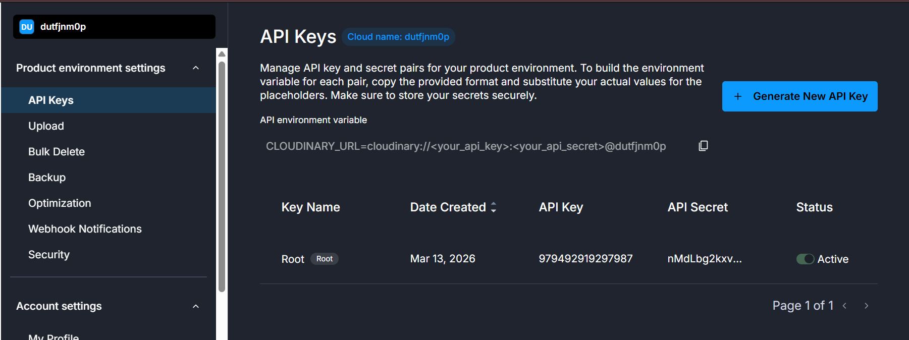

# 🖥️ System Design Document
## Expense Management System — ExpenseTracker Pro
### Built with React 18 + Vite 5 + JSON localStorage

**Version:** 2.0  
**Date:** 13 March 2026  
**Document Type:** System Design Specification  
**Status:** Approved

---

## 📋 Table of Contents

1. [System Overview](#1-system-overview)
2. [High-Level System Design](#2-high-level-system-design)
3. [React Component Design](#3-react-component-design)
4. [Context + Reducer Design](#4-context--reducer-design)
5. [JSON Database Design (utils/db.js)](#5-json-database-design-utilsdbjs)
6. [Data Models (Full Schema)](#6-data-models-full-schema)
7. [React Router Design](#7-react-router-design)
8. [Module Interaction Design](#8-module-interaction-design)
9. [Authentication & Session Design](#9-authentication--session-design)
10. [Error Handling Design](#10-error-handling-design)
11. [Performance Design](#11-performance-design)
12. [Vite Build Design](#12-vite-build-design)
13. [Scalability Considerations](#13-scalability-considerations)

---

## 1. System Overview

### 1.1 System Definition

ExpenseTracker Pro is a **React 18 Single-Page Application** bootstrapped with **Vite 5**. The entire system runs in the user's browser:

- **UI Layer:** React components with hooks
- **State Layer:** React Context API + useReducer
- **Data Layer:** `utils/db.js` → browser localStorage ↔ JSON files (seed)
- **Routing Layer:** React Router DOM v6 with protected routes
- **Build Layer:** Vite 5 (ESBuild + Rollup)

### 1.2 System Boundaries

```
┌──────────────────────────────────────────────────────────────┐
│                    SYSTEM BOUNDARY                           │
│                                                              │
│  ╔══════════════════════════════════════════════════════╗    │
│  ║           REACT APP (Vite SPA)                       ║    │
│  ║                                                      ║    │
│  ║  ┌────────────────┐  ┌───────────────────────────┐  ║    │
│  ║  │  React Pages   │  │    React Contexts         │  ║    │
│  ║  │  (Route Views) │  │    (Global State)         │  ║    │
│  ║  └────────────────┘  └───────────────────────────┘  ║    │
│  ║  ┌─────────────────────────────────────────────┐    ║    │
│  ║  │         utils/db.js (localStorage)           │    ║    │
│  ║  └─────────────────────────────────────────────┘    ║    │
│  ║  ┌─────────────────────────────────────────────┐    ║    │
│  ║  │    public/data/*.json (Seed Files)           │    ║    │
│  ║  └─────────────────────────────────────────────┘    ║    │
│  ╚══════════════════════════════════════════════════════╝    │
│                                                              │
│  npm packages (bundled by Vite):                            │
│  react | react-dom | react-router-dom | chart.js            │
│  react-chartjs-2 | react-hot-toast | xlsx | jspdf           │
│  lucide-react | date-fns                                     │
└──────────────────────────────────────────────────────────────┘
```

---

## 2. High-Level System Design

### 2.1 Three-Layer Architecture

```
┌────────────────────────────────────────────────────────────────┐
│                LAYER 1: UI LAYER (React Components)            │
│                                                                │
│  Pages:                                                        │
│  LoginPage | RegisterPage | DashboardPage | ExpensesPage       │
│  AddExpensePage | IncomePage | BudgetPage | CategoriesPage     │
│  ReportsPage | ApprovalsPage | NotificationsPage               │
│  ProfilePage | AdminPage                                       │
│                                                                │
│  Components:                                                   │
│  Layout | Sidebar | Navbar | KPICard | DataTable               │
│  PieChart | BarChart | LineChart | Modal | Badge               │
│  ProgressBar | SearchBar | FilterPanel | Pagination            │
│  ProtectedRoute                                                │
└──────────────────────────────┬─────────────────────────────────┘
                               │ useContext / custom hooks
┌──────────────────────────────▼─────────────────────────────────┐
│               LAYER 2: STATE LAYER (React Contexts)            │
│                                                                │
│  AuthContext        → users[], currentUser                     │
│  ExpenseContext     → expenses[], filters, page                │
│  IncomeContext      → income[]                                 │
│  BudgetContext      → budgets[]                                │
│  CategoryContext    → categories[]                             │
│  ApprovalContext    → approvals[]                              │
│  NotificationContext → notifications[]                         │
│  SettingsContext    → settings{}                               │
└──────────────────────────────┬─────────────────────────────────┘
                               │ db.getAll() / db.set()
┌──────────────────────────────▼─────────────────────────────────┐
│             LAYER 3: DATA LAYER (utils/db.js + localStorage)   │
│                                                                │
│  localStorage: ems_users | ems_expenses | ems_income           │
│                ems_categories | ems_budgets | ems_approvals    │
│                ems_notifications | ems_settings                │
│                ems_currentUser | ems_initialized               │
│                                                                │
│  public/data/*.json → fetched once → seeds localStorage        │
└────────────────────────────────────────────────────────────────┘
```

---

## 3. React Component Design

### 3.1 `App.jsx` — Root Component

```jsx
// src/App.jsx
import { createBrowserRouter, RouterProvider, Navigate } from 'react-router-dom';
import { Toaster } from 'react-hot-toast';

// Providers
import { SettingsProvider } from './context/SettingsContext';
import { AuthProvider } from './context/AuthContext';
import { CategoryProvider } from './context/CategoryContext';
import { ExpenseProvider } from './context/ExpenseContext';
import { IncomeProvider } from './context/IncomeContext';
import { BudgetProvider } from './context/BudgetContext';
import { ApprovalProvider } from './context/ApprovalContext';
import { NotificationProvider } from './context/NotificationContext';

// Pages & Layout
import { Layout } from './components/layout/Layout';
import { ProtectedRoute } from './components/common/ProtectedRoute';
import LoginPage from './pages/LoginPage';
import RegisterPage from './pages/RegisterPage';
import DashboardPage from './pages/DashboardPage';
import ExpensesPage from './pages/ExpensesPage';
import AddExpensePage from './pages/AddExpensePage';
import IncomePage from './pages/IncomePage';
import BudgetPage from './pages/BudgetPage';
import CategoriesPage from './pages/CategoriesPage';
import ReportsPage from './pages/ReportsPage';
import ApprovalsPage from './pages/ApprovalsPage';
import NotificationsPage from './pages/NotificationsPage';
import ProfilePage from './pages/ProfilePage';
import AdminPage from './pages/AdminPage';

const router = createBrowserRouter([
  { path: '/',         element: <LoginPage /> },
  { path: '/register', element: <RegisterPage /> },
  {
    path: '/',
    element: (
      <ProtectedRoute>
        <Layout />
      </ProtectedRoute>
    ),
    children: [
      { path: 'dashboard',         element: <DashboardPage /> },
      { path: 'expenses',          element: <ExpensesPage /> },
      { path: 'expenses/add',      element: <AddExpensePage /> },
      { path: 'expenses/edit/:id', element: <AddExpensePage /> },
      { path: 'income',            element: <IncomePage /> },
      { path: 'budget',            element: <BudgetPage /> },
      { path: 'categories',        element: <CategoriesPage /> },
      { path: 'reports',           element: <ReportsPage /> },
      {
        path: 'approvals',
        element: (
          <ProtectedRoute requiredRole="manager">
            <ApprovalsPage />
          </ProtectedRoute>
        )
      },
      { path: 'notifications', element: <NotificationsPage /> },
      { path: 'profile',       element: <ProfilePage /> },
      {
        path: 'admin',
        element: (
          <ProtectedRoute requiredRole="admin">
            <AdminPage />
          </ProtectedRoute>
        )
      },
    ]
  },
  { path: '*', element: <Navigate to="/" replace /> }
]);

export default function App() {
  return (
    <SettingsProvider>
      <AuthProvider>
        <CategoryProvider>
          <ExpenseProvider>
            <IncomeProvider>
              <BudgetProvider>
                <ApprovalProvider>
                  <NotificationProvider>
                    <RouterProvider router={router} />
                    <Toaster
                      position="bottom-right"
                      toastOptions={{
                        style: { background: '#242736', color: '#fff', border: '1px solid #2E3146' },
                        success: { iconTheme: { primary: '#2EC4B6', secondary: '#fff' } },
                        error:   { iconTheme: { primary: '#FF4757', secondary: '#fff' } },
                      }}
                    />
                  </NotificationProvider>
                </ApprovalProvider>
              </BudgetProvider>
            </IncomeProvider>
          </ExpenseProvider>
        </CategoryProvider>
      </AuthProvider>
    </SettingsProvider>
  );
}
```

### 3.2 `Layout.jsx` — App Shell

```jsx
// src/components/layout/Layout.jsx
import { Outlet } from 'react-router-dom';
import { Sidebar } from './Sidebar';
import { Navbar } from './Navbar';
import styles from './Layout.module.css';

export function Layout() {
  return (
    <div className={styles.appShell}>
      <Sidebar />
      <div className={styles.mainArea}>
        <Navbar />
        <main className={styles.pageContent}>
          <Outlet />
        </main>
      </div>
    </div>
  );
}
```

### 3.3 `KPICard.jsx` — Dashboard Card

```jsx
// src/components/common/KPICard.jsx
export function KPICard({ title, value, icon, trend, trendDir = 'up', color = 'primary' }) {
  return (
    <div className={`kpi-card kpi-card--${color}`}>
      <div className="kpi-icon">{icon}</div>
      <div className="kpi-body">
        <p className="kpi-title">{title}</p>
        <h2 className="kpi-value">{value}</h2>
        {trend && (
          <span className={`kpi-trend kpi-trend--${trendDir}`}>
            {trendDir === 'up' ? '↑' : '↓'} {trend}
          </span>
        )}
      </div>
    </div>
  );
}
```
### 3.4 `DataTable.jsx` — Generic Table

```jsx
// src/components/common/DataTable.jsx
export function DataTable({ columns, data, onEdit, onDelete, emptyMessage = 'No records found' }) {
  if (!data.length) {
    return <div className="empty-state">{emptyMessage}</div>;
  }
  return (
    <table className="data-table">
      <thead>
        <tr>
          {columns.map(col => (
            <th key={col.key}>{col.label}</th>
          ))}
          <th>Actions</th>
        </tr>
      </thead>
      <tbody>
        {data.map(row => (
          <tr key={row.id}>
            {columns.map(col => (
              <td key={col.key}>
                {col.render ? col.render(row[col.key], row) : row[col.key]}
              </td>
            ))}
            <td className="actions">
              {onEdit   && <button onClick={() => onEdit(row.id)}   className="btn-icon btn-edit">✏️</button>}
              {onDelete && <button onClick={() => onDelete(row.id)} className="btn-icon btn-delete">🗑️</button>}
            </td>
          </tr>
        ))}
      </tbody>
    </table>
  );
}
```

---

## 4. Context + Reducer Design

### 4.1 `AuthContext.jsx` — Complete Design

```jsx
// src/context/AuthContext.jsx
import { createContext, useContext, useReducer, useEffect } from 'react';
import { db } from '@/utils/db';
import { hashPassword } from '@/utils/auth';

const AuthContext = createContext(null);

const initialState = {
  users: db.getAll('ems_users'),
  currentUser: db.getSession(),
};

function authReducer(state, action) {
  switch (action.type) {
    case 'REGISTER':
      return { ...state, users: [...state.users, action.payload] };
    
    case 'LOGIN':
      return { ...state, currentUser: action.payload };
    
    case 'LOGOUT':
      return { ...state, currentUser: null };
    
    case 'UPDATE_PROFILE':
      return {
        ...state,
        users: state.users.map(u => u.id === action.payload.id ? { ...u, ...action.payload } : u),
        currentUser: { ...state.currentUser, ...action.payload }
      };
    
    case 'DEACTIVATE_USER':
      return {
        ...state,
        users: state.users.map(u => u.id === action.payload ? { ...u, isActive: false } : u)
      };
    
    default:
      return state;
  }
}

export function AuthProvider({ children }) {
  const [state, dispatch] = useReducer(authReducer, initialState);

  // Sync users array to localStorage
  useEffect(() => {
    db.set('ems_users', state.users);
  }, [state.users]);

  // Sync session to localStorage
  useEffect(() => {
    if (state.currentUser) {
      db.setSession(state.currentUser);
    } else {
      db.clearSession();
    }
  }, [state.currentUser]);

  const register = async ({ name, email, password, role = 'employee' }) => {
    const exists = state.users.find(u => u.email === email);
    if (exists) throw new Error('Email already registered');
    
    const hashedPw = await hashPassword(password);
    const newUser = {
      id: `usr_${Date.now()}`,
      name, email,
      password: hashedPw,
      role, currency: 'INR', theme: 'dark',
      isActive: true,
      createdAt: new Date().toISOString()
    };
    dispatch({ type: 'REGISTER', payload: newUser });
    return newUser;
  };

  const login = async (email, password) => {
    const hashedPw = await hashPassword(password);
    const user = state.users.find(u => u.email === email && u.password === hashedPw && u.isActive);
    if (!user) throw new Error('Invalid email or password');
    
    const sessionUser = { ...user };
    delete sessionUser.password;
    dispatch({ type: 'LOGIN', payload: sessionUser });
    return sessionUser;
  };

  const logout = () => {
    dispatch({ type: 'LOGOUT' });
  };

  return (
    <AuthContext.Provider value={{
      users: state.users,
      currentUser: state.currentUser,
      register, login, logout,
      dispatch
    }}>
      {children}
    </AuthContext.Provider>
  );
}

export const useAuth = () => {
  const ctx = useContext(AuthContext);
  if (!ctx) throw new Error('useAuth must be used within AuthProvider');
  return ctx;
};
```

---

### 4.2 `ExpenseContext.jsx` — Complete Design

```jsx
// src/context/ExpenseContext.jsx
import { createContext, useContext, useReducer, useEffect, useMemo } from 'react';
import { db } from '@/utils/db';

const ExpenseContext = createContext(null);

const initialState = {
  expenses: db.getAll('ems_expenses'),
  filters: { query: '', category: '', paymentMode: '', dateFrom: '', dateTo: '' },
  page: 1,
  pageSize: 10,
};

function expenseReducer(state, action) {
  switch (action.type) {
    case 'ADD':
      return { ...state, expenses: [action.payload, ...state.expenses] };
    
    case 'UPDATE':
      return {
        ...state,
        expenses: state.expenses.map(e =>
          e.id === action.payload.id ? { ...e, ...action.payload.changes, updatedAt: new Date().toISOString() } : e
        )
      };
    
    case 'DELETE':
      return { ...state, expenses: state.expenses.filter(e => e.id !== action.payload) };
    
    case 'SET_FILTERS':
      return { ...state, filters: { ...state.filters, ...action.payload }, page: 1 };
    
    case 'SET_PAGE':
      return { ...state, page: action.payload };
    
    case 'RESET_FILTERS':
      return { ...state, filters: initialState.filters, page: 1 };
    
    default:
      return state;
  }
}

export function ExpenseProvider({ children }) {
  const [state, dispatch] = useReducer(expenseReducer, initialState);

  useEffect(() => {
    db.set('ems_expenses', state.expenses);
  }, [state.expenses]);

  // Filtered expenses (memoized)
  const filteredExpenses = useMemo(() => {
    return state.expenses.filter(e => {
      const q = state.filters.query.toLowerCase();
      if (q && !e.title.toLowerCase().includes(q) && !e.notes?.toLowerCase().includes(q)) return false;
      if (state.filters.category && e.category !== state.filters.category) return false;
      if (state.filters.paymentMode && e.paymentMode !== state.filters.paymentMode) return false;
      if (state.filters.dateFrom && e.date < state.filters.dateFrom) return false;
      if (state.filters.dateTo && e.date > state.filters.dateTo) return false;
      return true;
    }).sort((a, b) => new Date(b.date) - new Date(a.date));
  }, [state.expenses, state.filters]);

  // Paginated expenses (memoized)
  const paginatedExpenses = useMemo(() => {
    const start = (state.page - 1) * state.pageSize;
    return filteredExpenses.slice(start, start + state.pageSize);
  }, [filteredExpenses, state.page, state.pageSize]);

  const addExpense = (data) => {
    dispatch({
      type: 'ADD',
      payload: { ...data, id: `exp_${Date.now()}`, createdAt: new Date().toISOString() }
    });
  };

  const updateExpense = (id, changes) => dispatch({ type: 'UPDATE', payload: { id, changes } });
  const deleteExpense = (id) => dispatch({ type: 'DELETE', payload: id });
  const setFilters = (f) => dispatch({ type: 'SET_FILTERS', payload: f });
  const setPage = (p) => dispatch({ type: 'SET_PAGE', payload: p });
  const getById = (id) => state.expenses.find(e => e.id === id) || null;

  return (
    <ExpenseContext.Provider value={{
      expenses: state.expenses,
      filteredExpenses,
      paginatedExpenses,
      filters: state.filters,
      page: state.page,
      pageSize: state.pageSize,
      totalFiltered: filteredExpenses.length,
      addExpense, updateExpense, deleteExpense,
      setFilters, setPage, getById,
      dispatch
    }}>
      {children}
    </ExpenseContext.Provider>
  );
}

export const useExpenses = () => useContext(ExpenseContext);
```

---

## 5. JSON Database Design (utils/db.js)

### 5.1 Complete `db.js` Implementation

```javascript
// src/utils/db.js

const KEYS = {
  users:         'ems_users',
  expenses:      'ems_expenses',
  income:        'ems_income',
  categories:    'ems_categories',
  budgets:       'ems_budgets',
  approvals:     'ems_approvals',
  notifications: 'ems_notifications',
  settings:      'ems_settings',
  currentUser:   'ems_currentUser',
  initialized:   'ems_initialized',
};

export const db = {
  KEYS,

  // ── Read ──────────────────────────────────────────────────────
  getAll(key) {
    try {
      const raw = localStorage.getItem(key);
      return raw ? JSON.parse(raw) : [];
    } catch {
      return [];
    }
  },

  getOne(key, id) {
    return this.getAll(key).find(r => r.id === id) || null;
  },

  getSettings() {
    try {
      return JSON.parse(localStorage.getItem(KEYS.settings)) || {};
    } catch {
      return {};
    }
  },

  // ── Write ─────────────────────────────────────────────────────
  set(key, data) {
    try {
      localStorage.setItem(key, JSON.stringify(data));
      return true;
    } catch (e) {
      if (e.name === 'QuotaExceededError') {
        console.error('localStorage quota exceeded!');
        // Context will handle toast notification
      }
      return false;
    }
  },

  setSettings(data) {
    localStorage.setItem(KEYS.settings, JSON.stringify(data));
  },

  // ── Session ───────────────────────────────────────────────────
  setSession(user) {
    localStorage.setItem(KEYS.currentUser, JSON.stringify(user));
  },

  getSession() {
    try {
      return JSON.parse(localStorage.getItem(KEYS.currentUser));
    } catch {
      return null;
    }
  },

  clearSession() {
    localStorage.removeItem(KEYS.currentUser);
  },

  // ── Seeding ───────────────────────────────────────────────────
  isInitialized() {
    return !!localStorage.getItem(KEYS.initialized);
  },

  async seed() {
    if (this.isInitialized()) return;
    
    const files = ['users', 'expenses', 'income', 'categories',
                   'budgets', 'approvals', 'notifications'];
    
    await Promise.all(files.map(async (name) => {
      const res = await fetch(`/data/${name}.json`);
      const json = await res.json();
      const data = json.data || json[name] || json;
      this.set(KEYS[name], Array.isArray(data) ? data : []);
    }));

    // Settings (single object, not array)
    const settingsRes = await fetch('/data/settings.json');
    const settings = await settingsRes.json();
    this.setSettings(settings);

    localStorage.setItem(KEYS.initialized, 'true');
    console.log('✅ Database seeded from JSON files');
  },

  // ── Export ────────────────────────────────────────────────────
  exportTable(key, name) {
    const data = this.getAll(key);
    const blob = new Blob(
      [JSON.stringify({ [name]: data }, null, 2)],
      { type: 'application/json' }
    );
    const url = URL.createObjectURL(blob);
    const a = document.createElement('a');
    a.href = url;
    a.download = `${name}_${new Date().toISOString().slice(0, 10)}.json`;
    a.click();
    URL.revokeObjectURL(url);
  },

  exportAll() {
    const backup = {};
    Object.entries(KEYS).forEach(([name, key]) => {
      if (['currentUser', 'initialized'].includes(name)) return;
      backup[name] = this.getAll(key);
    });
    const blob = new Blob([JSON.stringify(backup, null, 2)], { type: 'application/json' });
    const url = URL.createObjectURL(blob);
    const a = document.createElement('a');
    a.href = url;
    a.download = `ems_backup_${Date.now()}.json`;
    a.click();
    URL.revokeObjectURL(url);
  },

  // ── Reset ─────────────────────────────────────────────────────
  clearAll() {
    Object.values(KEYS).forEach(k => localStorage.removeItem(k));
  },

  // ── Storage Usage ─────────────────────────────────────────────
  getUsageBytes() {
    let total = 0;
    Object.values(KEYS).forEach(key => {
      const val = localStorage.getItem(key);
      if (val) total += val.length * 2; // UTF-16
    });
    return total;
  },

  getUsagePercent() {
    return ((this.getUsageBytes() / (5 * 1024 * 1024)) * 100).toFixed(1);
  }
};
```

---

### 5.2 Seeding Flow (First App Load)

```
main.jsx → ReactDOM.createRoot().render(<App />)
        │
App.jsx renders → Provider tree wraps router
        │
AuthProvider mounts
  → useEffect runs db.seed() on first render (if !db.isInitialized())
  → fetch('/data/users.json')  → db.set('ems_users', [...])
  → fetch('/data/categories.json') → db.set('ems_categories', [...])
  → ... all 8 files
  → db.markInitialized()
        │
CategoryProvider mounts
  → initialState = { categories: db.getAll('ems_categories') }
  → Already populated! ✅
        │
ExpenseProvider mounts
  → initialState = { expenses: db.getAll('ems_expenses') }
  → Empty [] on first run ✅
        │
All Contexts initialized → App renders
```

---

## 6. Data Models (Full Schema)

### 6.1 TypeScript-style Interface Definitions

```typescript
// User
interface User {
  id:         string;       // "usr_1710000000001"
  name:       string;       // "Rahul Sharma"
  email:      string;       // "rahul@example.com"
  password:   string;       // SHA-256 hex string
  role:       'admin' | 'manager' | 'employee';
  department: string;
  avatar:     string;       // base64 or ""
  currency:   string;       // "INR" | "USD"
  theme:      'dark' | 'light';
  isActive:   boolean;
  createdAt:  string;       // ISO 8601
}

// Expense
interface Expense {
  id:          string;      // "exp_1710000000001"
  title:       string;
  amount:      number;
  date:        string;      // "YYYY-MM-DD"
  time:        string;      // "HH:MM"
  category:    string;      // FK → Category.id
  paymentMode: 'Cash' | 'UPI' | 'Card' | 'NetBanking';
  receipt:     string;      // base64 or ""
  isRecurring: boolean;
  frequency:   'Daily' | 'Weekly' | 'Monthly' | '';
  status:      'Draft' | 'Pending' | 'Approved' | 'Rejected';
  userId:      string;      // FK → User.id
  notes:       string;
  createdAt:   string;
  updatedAt?:  string;
}

// Income
interface Income {
  id:        string;        // "inc_1710000000001"
  source:    'Salary' | 'Freelance' | 'Business' | 'Investment' | 'Other';
  amount:    number;
  date:      string;
  userId:    string;
  notes:     string;
  createdAt: string;
}

// Category
interface Category {
  id:        string;        // "cat_food"
  name:      string;        // "Food & Dining"
  icon:      string;        // lucide-react icon name: "UtensilsCrossed"
  color:     string;        // "#FF6384"
  createdBy: string;        // "system" | userId
  createdAt: string;
}

// Budget
interface Budget {
  id:          string;      // "bud_1710000000001"
  categoryId:  string;      // FK → Category.id
  monthYear:   string;      // "2026-03"
  limitAmount: number;
  userId:      string;
  createdAt:   string;
}

// Approval
interface Approval {
  id:         string;       // "apr_1710000000001"
  expenseId:  string;       // FK → Expense.id
  approvedBy: string;       // FK → User.id
  status:     'Approved' | 'Rejected';
  comment:    string;
  timestamp:  string;       // ISO 8601
}

// Notification
interface Notification {
  id:        string;        // "ntf_1710000000001"
  userId:    string;        // Recipient user id
  type:      'success' | 'error' | 'warning' | 'info';
  message:   string;
  link:      string;        // React Router path to navigate to
  isRead:    boolean;
  createdAt: string;
}

// Settings (singleton, not array)
interface Settings {
  appName:         string;   // "ExpenseTracker Pro"
  version:         string;   // "1.0.0"
  currency:        string;   // "INR"
  currencySymbol:  string;   // "₹"
  dateFormat:      string;   // "DD/MM/YYYY"
  theme:           'dark' | 'light';
  language:        'en' | 'hi';
  taxRate:         number;   // 18
  fiscalYearStart: string;   // "April"
}
```

---

## 7. React Router Design

### 7.1 Route Tree

```
/ (root)
├── /                   → <LoginPage>           (public)
├── /register           → <RegisterPage>        (public)
│
└── / (protected wrapper: <ProtectedRoute> + <Layout>)
    ├── /dashboard          → <DashboardPage>
    ├── /expenses           → <ExpensesPage>
    ├── /expenses/add       → <AddExpensePage> (add mode)
    ├── /expenses/edit/:id  → <AddExpensePage> (edit mode)
    ├── /income             → <IncomePage>
    ├── /budget             → <BudgetPage>
    ├── /categories         → <CategoriesPage>
    ├── /reports            → <ReportsPage>
    ├── /approvals          → <ApprovalsPage>  (manager+ only)
    ├── /notifications      → <NotificationsPage>
    ├── /profile            → <ProfilePage>
    ├── /admin              → <AdminPage>       (admin only)
    └── /*                  → <Navigate to="/" />
```

### 7.2 Edit Mode in `AddExpensePage`

```jsx
// pages/AddExpensePage.jsx
import { useParams, useNavigate } from 'react-router-dom';
import { useExpenses } from '@/hooks/useExpenses';

export default function AddExpensePage() {
  const { id } = useParams();         // undefined for add, id for edit
  const isEditMode = !!id;
  const { getById, addExpense, updateExpense } = useExpenses();
  
  const existingExpense = isEditMode ? getById(id) : null;
  
  const [form, setForm] = useState(
    existingExpense || { title: '', amount: '', date: today, ... }
  );

  const handleSubmit = (e) => {
    e.preventDefault();
    if (isEditMode) {
      updateExpense(id, form);
      toast.success('Expense updated!');
    } else {
      addExpense(form);
      toast.success('Expense added!');
    }
    navigate('/expenses');
  };
  
  return (
    <div>
      <h1>{isEditMode ? 'Edit Expense' : 'Add New Expense'}</h1>
      <form onSubmit={handleSubmit}>
        {/* form fields */}
      </form>
    </div>
  );
}
```

---

## 8. Module Interaction Design

### 8.1 Data Flow — Add Expense (Complete)

```
User on /expenses/add
  ↓
<AddExpensePage> renders
  ↓ useExpenses() hook → reads from ExpenseContext
  ↓ useCategories() hook → reads from CategoryContext (for dropdown)
  ↓
User fills form and clicks Submit
  ↓
handleSubmit(e) fires
  ↓
const { isValid, errors } = validateExpense(form)  [validators.js]
  ↓
if (!isValid) → setErrors(errors) → inline error messages shown
  ↓
if (valid) → addExpense(form)   [useExpenses hook]
  ↓
ExpenseContext.addExpense:
  dispatch({ type: 'ADD', payload: { ...form, id: `exp_${Date.now()}`, createdAt: now } })
  ↓
expenseReducer:
  return { ...state, expenses: [newExpense, ...state.expenses] }
  ↓
useEffect in ExpenseProvider:
  db.set('ems_expenses', state.expenses)  → localStorage updated ✅
  ↓
If expense.status === 'Pending' (submitted for approval):
  notificationDispatch({ type: 'CREATE', payload: {
    userId: managerId,
    message: `New expense "${form.title}" submitted for approval`,
    type: 'info',
    link: '/approvals'
  }})
  ↓
toast.success('Expense added! ✅')   [react-hot-toast]
useNavigate()('/expenses')
  ↓
ExpensesPage renders with updated paginatedExpenses from useMemo
(no page reload — React state is reactive) ✅
```

### 8.2 Dashboard Chart Data Flow

```jsx
// DashboardPage.jsx
const { expenses } = useExpenses();
const { categories } = useCategories();
const { budgets } = useBudget();

// All computations via useMemo (no re-compute unless deps change)

const totalThisMonth = useMemo(() =>
  expenses
    .filter(e => e.date.startsWith(currentMonth))
    .reduce((sum, e) => sum + e.amount, 0),
  [expenses, currentMonth]
);

const categoryData = useMemo(() => {
  const byCategory = expenses
    .filter(e => e.date.startsWith(currentMonth))
    .reduce((acc, e) => {
      acc[e.category] = (acc[e.category] || 0) + e.amount;
      return acc;
    }, {});
  
  return categories.map(cat => ({
    name: cat.name,
    amount: byCategory[cat.id] || 0,
    color: cat.color
  })).filter(c => c.amount > 0);
}, [expenses, categories, currentMonth]);

const monthlyData = useMemo(() => {
  // Last 6 months totals
  return getLast6Months().map(month => ({
    label: formatMonth(month),
    total: expenses
      .filter(e => e.date.startsWith(month))
      .reduce((sum, e) => sum + e.amount, 0)
  }));
}, [expenses]);

return (
  <>
    <KPICard title="This Month" value={formatCurrency(totalThisMonth)} />
    <PieChart data={categoryData} />
    <BarChart data={monthlyData} />
  </>
);
```

---

## 9. Authentication & Session Design

### 9.1 Session Lifecycle

```
main.jsx → App mounts
        │
AuthProvider initialState:
  currentUser = db.getSession()  ← from localStorage
        │
  [null]                    [user object]
    │                            │
    ▼                            ▼
<ProtectedRoute>           <ProtectedRoute>
  currentUser = null         currentUser = { id, name, role }
  <Navigate to="/" />        render children ✅
        │
  <LoginPage />
  user enters credentials
        │
  AuthContext.login(email, pw)
    → hashPassword(pw) [SubtleCrypto]
    → find user in state.users
    → dispatch({ type: 'LOGIN', payload: sessionUser })
    → useEffect → db.setSession(sessionUser)
        │
  navigate('/dashboard')
        │
  <DashboardPage /> → useAuth().currentUser is now set ✅
```

### 9.2 Password Hashing (SHA-256)

```javascript
// src/utils/auth.js
export async function hashPassword(password) {
  const encoder = new TextEncoder();
  const data = encoder.encode(password);
  const hashBuffer = await crypto.subtle.digest('SHA-256', data);
  return Array.from(new Uint8Array(hashBuffer))
    .map(b => b.toString(16).padStart(2, '0'))
    .join('');
}

// Usage in AuthContext:
const hashedPw = await hashPassword(password);  // async, uses Web Crypto API
```

### 9.3 Role Access Matrix

| Route | Employee | Manager | Admin |
|---|---|---|---|
| `/` (login) | ✅ | ✅ | ✅ |
| `/dashboard` | ✅ own data | ✅ team data | ✅ all data |
| `/expenses` | ✅ own only | ✅ team | ✅ all |
| `/expenses/add` | ✅ | ✅ | ✅ |
| `/income` | ✅ | ✅ | ✅ |
| `/budget` | ✅ | ✅ | ✅ |
| `/reports` | ✅ own | ✅ team | ✅ all |
| `/approvals` | ❌ redirect | ✅ | ✅ |
| `/admin` | ❌ redirect | ❌ redirect | ✅ |

---

## 10. Error Handling Design

### 10.1 React Error Boundary

```jsx
// components/common/ErrorBoundary.jsx
import { Component } from 'react';

export class ErrorBoundary extends Component {
  state = { hasError: false, error: null };
  
  static getDerivedStateFromError(error) {
    return { hasError: true, error };
  }
  
  componentDidCatch(error, info) {
    console.error('React Error Boundary caught:', error, info);
  }
  
  render() {
    if (this.state.hasError) {
      return (
        <div className="error-boundary">
          <h2>Something went wrong</h2>
          <p>{this.state.error?.message}</p>
          <button onClick={() => window.location.reload()}>Reload App</button>
        </div>
      );
    }
    return this.props.children;
  }
}
```

### 10.2 Storage Error Handling

```javascript
// In db.js set():
set(key, data) {
  try {
    localStorage.setItem(key, JSON.stringify(data));
    return true;
  } catch (e) {
    if (e.name === 'QuotaExceededError') {
      // Context dispatches a global error notification
      window.dispatchEvent(new CustomEvent('storage-full'));
    }
    return false;
  }
}

// In App.jsx:
useEffect(() => {
  window.addEventListener('storage-full', () => {
    toast.error('Storage full! Please export and clear old data.', { duration: 8000 });
  });
}, []);
```

### 10.3 Form Error Pattern (React)

```jsx
// Controlled validation pattern
const [errors, setErrors] = useState({});

const handleSubmit = (e) => {
  e.preventDefault();
  const { isValid, errors } = validateExpense(form);
  if (!isValid) {
    setErrors(errors);
    toast.error('Please fix the errors in the form');
    return;
  }
  setErrors({});
  // proceed...
};

// Render inline errors:
<input name="amount" ... className={errors.amount ? 'input-error' : ''} />
{errors.amount && <span className="error-msg">{errors.amount}</span>}
```

---

## 11. Performance Design

### 11.1 React Optimization Techniques

| Technique | Where Used | Purpose |
|---|---|---|
| `useMemo` | ExpenseContext, DashboardPage | Memoize filtered/aggregated data |
| `useCallback` | Event handlers passed to children | Prevent child re-renders |
| `React.memo` | DataTable, KPICard, Chart components | Skip re-render when props unchanged |
| Debounce | SearchBar component | Limit filter recalculation (300ms) |
| Pagination | ExpensesPage (10/page) | Never render all records at once |
| Lazy imports | Page components via React.lazy() | Code splitting per route |
| Vite code splitting | `manualChunks` in vite.config.js | Separate vendor/chart bundles |

### 11.2 React.lazy + Suspense (Code Splitting)

```jsx
// App.jsx — Lazy load all pages
const DashboardPage = React.lazy(() => import('./pages/DashboardPage'));
const ExpensesPage  = React.lazy(() => import('./pages/ExpensesPage'));
// ... all pages

// Wrap with Suspense
<Suspense fallback={<div className="page-loader">Loading...</div>}>
  <Outlet />
</Suspense>
```

### 11.3 Vite Build Optimization

```javascript
// vite.config.js
build: {
  rollupOptions: {
    output: {
      manualChunks: {
        'vendor':  ['react', 'react-dom', 'react-router-dom'],
        'charts':  ['chart.js', 'react-chartjs-2'],
        'export':  ['xlsx', 'jspdf', 'jspdf-autotable'],
        'utils':   ['date-fns', 'lucide-react'],
      }
    }
  }
}
// Result: 4 separate chunks → better browser caching
```

---

## 12. Vite Build Design

### 12.1 `vite.config.js` (Complete)

```javascript
import { defineConfig } from 'vite';
import react from '@vitejs/plugin-react';
import path from 'path';

export default defineConfig({
  plugins: [react()],
  
  resolve: {
    alias: {
      '@': path.resolve(__dirname, './src'),
    }
  },
  
  server: {
    port: 5173,
    open: true,  // Auto-open browser on start
  },
  
  build: {
    outDir: 'dist',
    sourcemap: false,
    minify: 'esbuild',
    rollupOptions: {
      output: {
        manualChunks: {
          vendor: ['react', 'react-dom', 'react-router-dom'],
          charts: ['chart.js', 'react-chartjs-2'],
          export: ['xlsx', 'jspdf'],
          utils:  ['date-fns', 'lucide-react'],
        }
      }
    }
  },
  
  optimizeDeps: {
    include: ['react', 'react-dom', 'react-router-dom', 'chart.js']
  }
});
```

### 12.2 `main.jsx` Entry Point

```jsx
// src/main.jsx
import React from 'react';
import ReactDOM from 'react-dom/client';
import App from './App.jsx';
import './styles/index.css';

ReactDOM.createRoot(document.getElementById('root')).render(
  <React.StrictMode>
    <App />
  </React.StrictMode>,
);
```

---

## 13. Scalability Considerations

### 13.1 Current Architecture Limits

| Limit | Value | Impact |
|---|---|---|
| localStorage capacity | ~5MB | ~2,000 expense records max |
| React state (single device) | In-memory | Lost on hard refresh if localStorage fails |
| No WebSockets | N/A | No real-time multi-user |
| Single browser | One device | No sync across devices |

### 13.2 Migration Path to v2.0

The React + Context architecture is designed so that the **only files that need to change** to add a real backend are the Context files and `db.js`:

```
v1.0 (localStorage):         v2.0 (REST API backend):
─────────────────────        ──────────────────────────────────
db.js (localStorage)    →    api.js (fetch/axios REST calls)
AuthContext.jsx         →    Replace db.set/get with await api.post/get
ExpenseContext.jsx      →    Same shape, different data source
useReducer              →    Can keep or switch to React Query / Zustand

Pages, Components, Hooks → UNCHANGED ✅
```

### 13.3 Advanced Options for v2.0

- **State:** Replace Context + useReducer with **Zustand** (simpler) or **Redux Toolkit**
- **Storage:** Replace localStorage with **Supabase** (free tier, PostgreSQL)
- **Auth:** Replace SHA-256 with **Supabase Auth / Firebase Auth**
- **ORM:** **Prisma** with PostgreSQL on backend
- **Hosting backend:** **Vercel Edge Functions** or **Supabase Edge Functions**

---

*Document End — System Designe.md v2.0 (React + Vite)*
